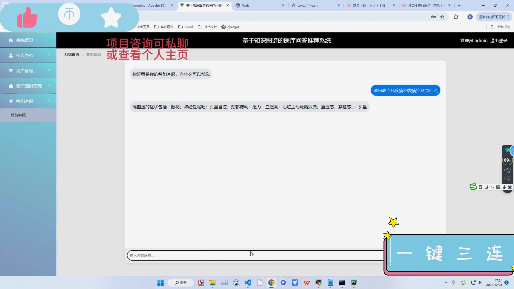
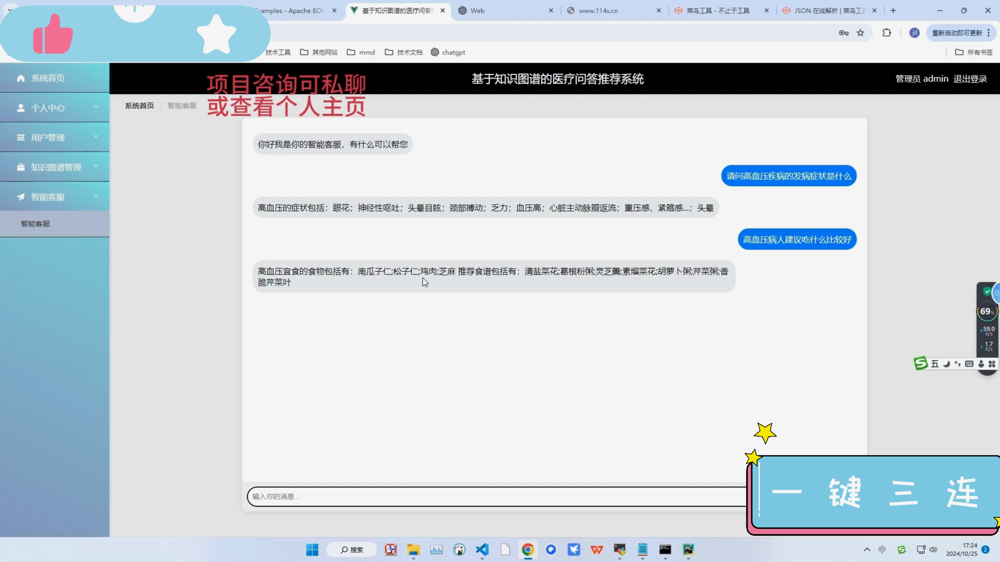
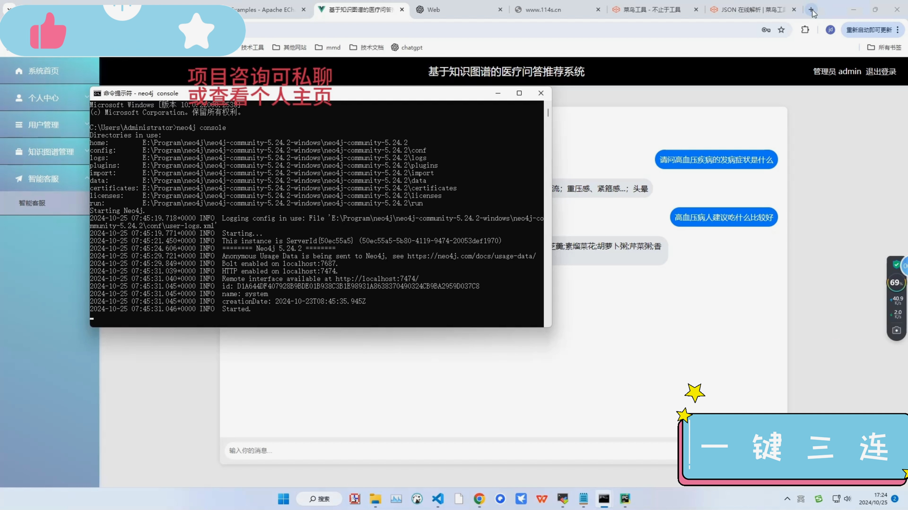
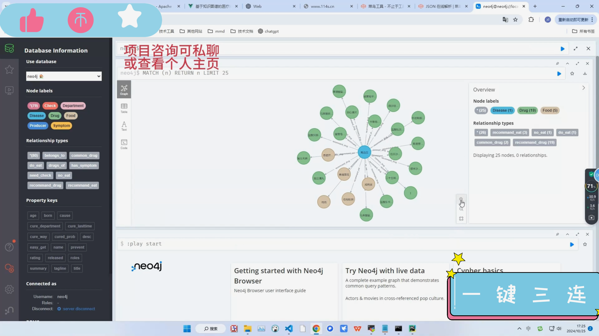

## 计算机毕业设计Python+Neo4j知识图谱医疗问答系统 大模型 机器学习 深度学习 人工智能 大数据毕业设计 Python爬虫 Python毕业设计

## 要求
### 源码有偿！一套(论文 PPT 源码+sql脚本+教程)

### 
### 加好友前帮忙start一下，并备注github有偿纯python医疗问答
### 我的QQ号是2827724252或者798059319或者 1679232425或者微信:bysj2023nb

# 

### 加qq好友说明（被部分 网友整得心力交瘁）：
    1.加好友务必按照格式备注
    2.避免浪费各自的时间！
    3.当“客服”不容易，repo 主是体面人，不爆粗，性格好，文明人。

## 演示视频
https://www.bilibili.com/video/BV1wBUPY5EHk/

## 运行截图

